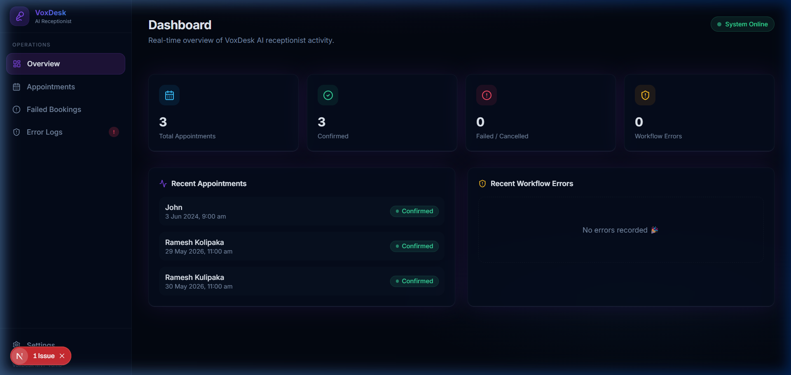
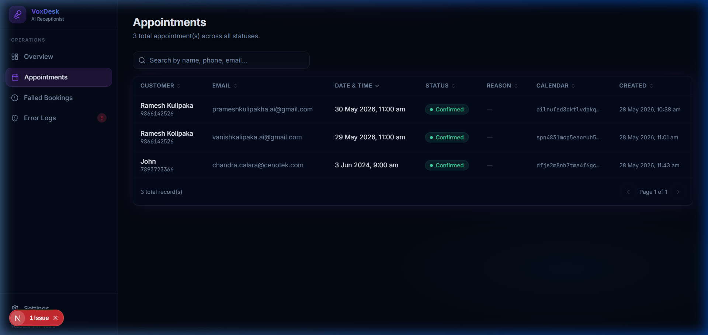
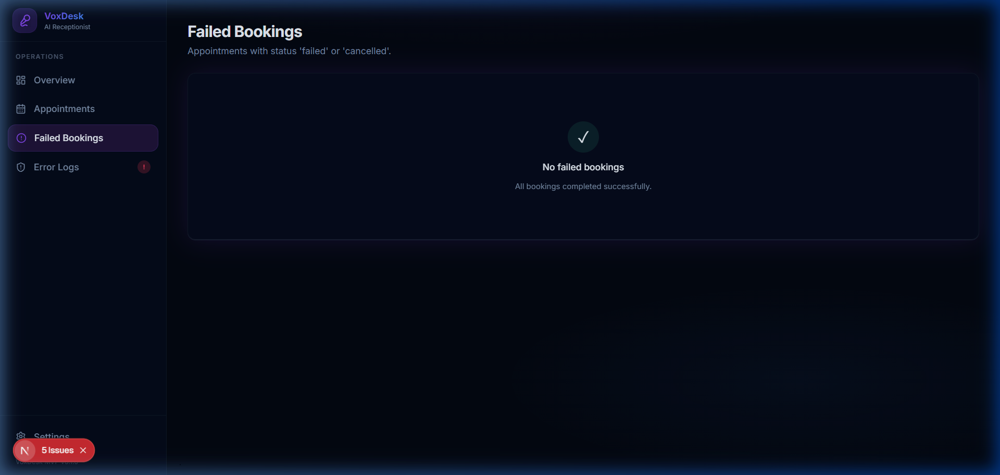
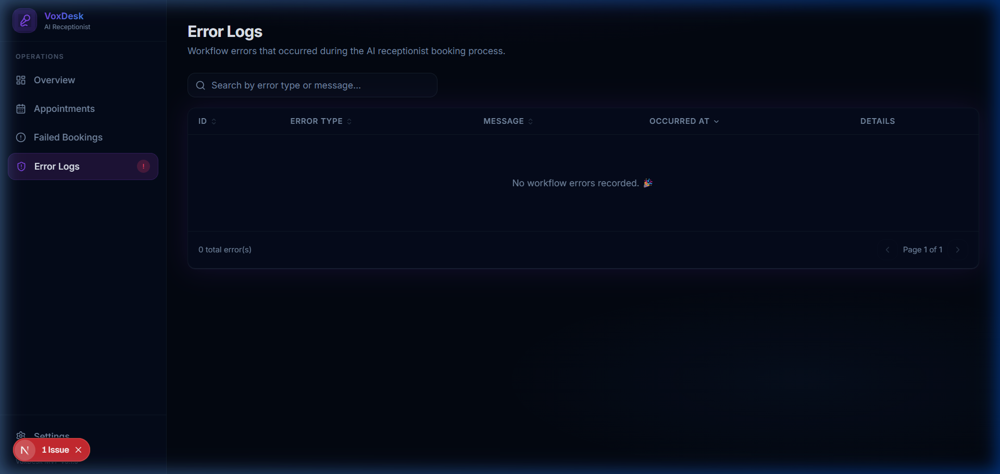

<div align="center">

# 🎙️ VoxDesk — AI Voice Receptionist Platform

**An end-to-end AI-powered voice receptionist that answers calls, books appointments, and logs everything — without a human in the loop.**

[](https://nextjs.org/)
[](https://www.typescriptlang.org/)
[](https://tailwindcss.com/)
[](https://supabase.com/)
[](https://vercel.com/)

</div>

---

## 🧠 What Is VoxDesk?

VoxDesk is a **production-grade AI voice receptionist system** built for service-based businesses. When a customer calls:

1. The AI answers instantly in natural language
2. Understands the caller's intent
3. Checks real-time calendar availability
4. Books, transfers, or escalates — autonomously
5. Logs every outcome to a database

**This repository is the Admin Dashboard** — a modern SaaS web app that gives business owners full visibility into every call, booking, and workflow error in real-time.

> 🚀 Built as a proof-of-concept to demonstrate full-stack AI integration across voice, automation, and database layers.

---

## 📸 Dashboard Preview

| Overview | Appointments |
|---|---|
|  |  |

| Failed Bookings | Error Logs |
|---|---|
|  |  |

---

## ⚙️ Architecture — Voice AI Workflow End to End

> Real-time voice interactions powered by automation and AI.

```
  ┌──────────────┐   ┌────────────────────┐   ┌──────────────────────────────────┐
  │ 1  Incoming  │   │  2  Vobiz           │   │  3  Retell AI  (Voice Agent)     │
  │    Call      │   │  (Telecom Layer)    │   │                                  │
  │              │──►│                    │──►│  ✔ Answers the call              │
  │  Customer    │   │  ✔ Receives PSTN   │   │  ✔ Understands intent & context  │
  │  calls the   │   │  ✔ SIP trunking    │   │  ✔ Collects caller information   │
  │  business    │   │  ✔ Routes to       │   │  ✔ Handles appointment booking   │
  │              │   │    Retell AI        │   │  ✔ Decides action (book/transfer │
  └──────────────┘   └────────────────────┘   │    /ticket/follow-up)            │
                                               │  ✔ Invokes n8n webhook functions │
                                               └──────────────┬───────────────────┘
                                                              │ Webhook (JSON)
                                                              ▼
  ┌───────────────────────────────────────────────────────────────────────────────┐
  │  4  n8n Workflow  (Automation & Integrations)                                 │
  │                                                                               │
  │  ┌─────────────────────┐  ┌──────────────────────┐  ┌──────────────────────┐ │
  │  │  Webhook Trigger     │  │ Process, Validate    │  │  Business Logic      │ │
  │  │  Receives events     │─►│ & Route              │─►│  Applies rules,      │ │
  │  │  from Retell AI      │  │ Extracts & validates │  │  decides next action │ │
  │  └─────────────────────┘  └──────────────────────┘  └──────────┬───────────┘ │
  │                                                                  │             │
  │  ┌───────────────────────────────────────────────────────────────┘             │
  │  ▼                                                                             │
  │  ┌─────────────────────┐   Connects with external services                    │
  │  │  Integrations        │─── Google Calendar  (check / create event)          │
  │  │                      │─── Supabase         (write appointments + errors)   │
  │  └─────────────────────┘─── CRM / Email / SMS / WhatsApp                     │
  └───────────────────────────────────────┬───────────────────────────────────────┘
                                          │
         ┌────────────────────────────────┼──────────────────────────────────┐
         ▼                                ▼                                  ▼
  ┌─────────────────┐     ┌────────────────────────────┐     ┌──────────────────────┐
  │  5  Outcomes     │     │  Supabase (PostgreSQL)      │     │  VoxDesk Dashboard   │
  │                  │     │                            │     │  (this repo)         │
  │  ✔ Book appt.   │     │  appointments              │────►│                      │
  │  ✔ Capture lead │     │  error_logs                │     │  /dashboard          │
  │  ✔ Support tkt. │     │                            │     │  /appointments       │
  │  ✔ Transfer     │     └────────────────────────────┘     │  /failed-bookings    │
  │  ✔ Follow-up    │                                         │  /error-logs         │
  └─────────────────┘                                         └──────────────────────┘

  ◄────────────────── Call transcripts, workflow logs, updates & follow-ups ───────────────►
```

---

## ✨ Key Features

### Dashboard
- 📊 **Live stat cards** — Total Appointments, Confirmed, Failed/Cancelled, Workflow Errors
- 🕐 **Recent activity feed** — Latest appointments and workflow errors at a glance
- 🟢 **System status indicator** — Real-time "System Online" badge

### Appointments Page
- 🔍 **Global search** — Filter by name, phone, or email instantly
- ↕️ **Column sorting** — Sort by date, status, or any field
- 📄 **Pagination** — Handles large datasets cleanly
- 🏷️ **Status badges** — Colour-coded confirmed / pending / cancelled / failed

### Failed Bookings
- ⚠️ **Isolated failure view** — Only shows `failed` or `cancelled` records
- Shows cancellation reason captured by the AI during the call

### Error Logs
- 🔴 **Workflow error tracking** — Every n8n execution error is logged
- 🗂️ **Expandable JSONB detail** — View the full appointment data snapshot at the time of error

---

## 🛠️ Tech Stack

| Layer | Technology | Why |
|---|---|---|
| **Framework** | Next.js 15 (App Router) | Server components, SSR, API routes in one repo |
| **Language** | TypeScript | End-to-end type safety across DB, API, and UI |
| **Styling** | Tailwind CSS | Utility-first, consistent dark-mode design system |
| **UI Components** | shadcn/ui + Radix UI | Accessible, unstyled primitives with full control |
| **Tables** | TanStack Table v8 | Headless, performant, sort/filter/paginate |
| **Database** | Supabase (PostgreSQL) | Instant REST API, real-time, hosted |
| **Voice AI** | Retell AI | LLM-powered voice agent with function calling |
| **Telephony** | Vobiz | SIP/PSTN trunk connected to Retell |
| **Automation** | n8n | No-code/low-code workflow orchestration |
| **Calendar** | Google Calendar API | Availability checks and event creation |
| **Deployment** | Vercel | Edge-optimised Next.js hosting |

---

## 🧱 Project Structure

```
voxdesk/
├── app/
│   ├── api/
│   │   ├── retell/webhook/   # Receives Retell AI call lifecycle events
│   │   └── health/           # Liveness probe for uptime monitoring
│   ├── dashboard/
│   │   ├── page.tsx          # Overview — stats + recent activity
│   │   ├── appointments/     # Full appointment table
│   │   ├── failed-bookings/  # Filtered failure view
│   │   └── error-logs/       # Workflow error log with JSONB expand
│   ├── layout.tsx            # Root layout (dark mode enforced)
│   └── globals.css           # Design tokens, component classes
│
├── components/
│   ├── dashboard/
│   │   ├── AppointmentsTable.tsx  # Search + sort + paginate table
│   │   ├── ErrorLogsTable.tsx     # Error table with expandable detail
│   │   ├── Sidebar.tsx            # Fixed navigation
│   │   └── StatusBadge.tsx        # Colour-coded status pill
│   └── shared/
│       └── PageHeader.tsx         # Reusable page title + action area
│
├── lib/
│   ├── supabase.ts           # Re-export of both Supabase clients
│   ├── supabase/
│   │   ├── client.ts         # Browser client (anon key)
│   │   └── server.ts         # Server client (service role — bypasses RLS)
│   ├── services/             # Clean data-access layer (decoupled from UI)
│   │   ├── dashboard.ts      # getDashboardStats()
│   │   ├── appointments.ts   # getAppointments(), getFailedAppointments()
│   │   └── errorLogs.ts      # getErrorLogs(), getRecentErrorLogs()
│   ├── retell/
│   │   └── verify.ts         # HMAC-SHA256 webhook signature verification
│   ├── types/
│   │   └── index.ts          # All TypeScript interfaces
│   └── utils.ts              # Shared formatting + badge utilities
│
├── hooks/
│   └── useDebounce.ts        # Generic debounce hook for search inputs
│
└── supabase/
    └── migrations/
        └── 001_init.sql      # Schema reference (appointments + error_logs)
```

---

## 🗃️ Database Schema

### `appointments`
| Column | Type | Description |
|---|---|---|
| `id` | int8 | Primary key |
| `name` | text | Customer full name |
| `phone` | text | Customer phone number |
| `email` | text | Customer email (optional) |
| `appointment_date` | date | Booking date `YYYY-MM-DD` |
| `appointment_time` | text | Booking time `HH:MM` 24h |
| `status` | text | `confirmed` / `pending` / `cancelled` / `failed` |
| `cancellation_reason` | text | AI-captured reason if not confirmed |
| `calendar_event_id` | text | Linked Google Calendar event ID |
| `created_at` | timestamp | Record creation timestamp |

### `error_logs`
| Column | Type | Description |
|---|---|---|
| `id` | int8 | Primary key |
| `error_type` | text | Error category from n8n |
| `error_message` | text | Full error description |
| `appointment_data` | jsonb | Full booking data snapshot at time of error |
| `created_at` | timestamp | When the error occurred |

---

## 🚀 Getting Started

### Prerequisites
- Node.js 18+
- A [Supabase](https://supabase.com) project
- A [Retell AI](https://retellai.com) account (for webhook integration)

### Setup

```bash
# 1. Clone & install
git clone https://github.com/KolipakaRamesh/VoxDesk.git
cd VoxDesk
npm install

# 2. Configure environment
cp .env.local.example .env.local
# Fill in your Supabase URL, anon key, and service role key

# 3. Run the database migration
# Paste supabase/migrations/001_init.sql into Supabase SQL Editor

# 4. Start the dev server
npm run dev
```

Open [http://localhost:3000](http://localhost:3000) — redirects to `/dashboard`.

### Environment Variables

| Variable | Required | Description |
|---|---|---|
| `NEXT_PUBLIC_SUPABASE_URL` | ✅ | Supabase project URL |
| `NEXT_PUBLIC_SUPABASE_ANON_KEY` | ✅ | Public anon key (browser client) |
| `SUPABASE_SERVICE_ROLE_KEY` | ✅ | Secret service role key (server only) |
| `RETELL_API_KEY` | ✅ | Retell AI API key (webhook verification) |

---

## 🔌 API Endpoints

| Method | Path | Description |
|---|---|---|
| `POST` | `/api/retell/webhook` | Receives call lifecycle events from Retell AI |
| `GET` | `/api/health` | Liveness probe for deployment monitoring |

---

## 📋 What This Enables

| Capability | Description |
|---|---|
| 🔗 **Seamless Integration** | Connects voice, calendar, CRM, and database via webhooks |
| 🧠 **Smart Conversations** | AI agent handles natural multi-turn voice conversations |
| 📞 **Reliable Call Handling** | Scalable SIP routing with automated fallback and escalation |
| ⚙️ **Real-world Automation** | Event-driven n8n orchestration for every booking outcome |
| 🔒 **Secure by Design** | HMAC-SHA256 webhook verification, service role scoped DB access |

---

## 📈 Build Status

| Step | Status |
|---|---|
| TypeScript compile | ✅ Clean (0 errors) |
| Production build | ✅ Passing |
| Supabase connection | ✅ Live — reading real data |
| Dashboard pages | ✅ All 4 pages operational |

---

## 🗺️ Roadmap

- [x] Next.js 15 + TypeScript scaffold
- [x] Supabase integration (server + browser clients, service role)
- [x] Clean services layer (`lib/services/`)
- [x] Retell AI webhook receiver with HMAC verification
- [x] Admin Dashboard — Overview, Appointments, Failed Bookings, Error Logs
- [x] Dark mode SaaS design system
- [x] Searchable / sortable / paginated data tables
- [ ] n8n workflows deployed and activated
- [ ] Retell agent configured with booking functions
- [ ] Vobiz number connected to Retell agent
- [ ] Vercel production deployment

---

## 👨‍💻 Author

**Ramesh Kolipaka**
- GitHub: [@KolipakaRamesh](https://github.com/KolipakaRamesh)

---

## 📄 License

Private — VoxDesk MVP. All rights reserved.
